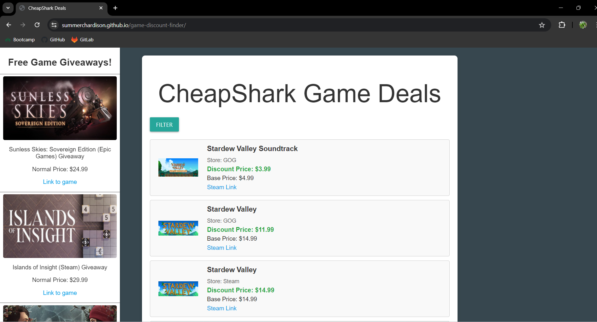

# game-discount-finder

## Description

This application allows users to find deals on games with the options to sort them by name, store, and ascending/descending in price. It gives a list of games that are currently being given away for free. It was made using HTML, CSS, JavaScript, fetch API, cheapshark API, Gamerpower API, and materilize. It was made so that gamers would be able to find and enjoy their favorite games for cheaper than they would usually be able to find, and as a way to practice using our API, JavaScript, CSS, and HTML skills.

## To Application

[https://summerchardison.github.io/game-discount-finder/](https://summerchardison.github.io/game-discount-finder/)

## Credits

Summer Hardison

Cameron Gillum

Eric Wong

Thank you to our peers at UNCC, and to the developers of the afformentioned APIs and CSS framework, without you our development journeys would be a lot harder.
